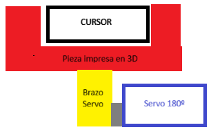

# Nombre del Proyecto

En este readme explicaremos la idea que se puede aplicar para solucionar el problema de movimiento del cursor en la competición de Eurobot 2025-2026 para artic-circuits.

## 🛠️ Problema a resolver:
Se ha de mover un elemento deslizándolo por una pared de tal forma que según se desplace se aumentará el puntuaje siempre y cuando no se supere el máximo lo que implicará la disminución de puntos, el valor que cuenta es el que tenga el cursor al final de la ronda.

## 📸 Preview:

## 🚀 Elementos
- La pieza negra (**El cursor**): Se ha de desplazar a una posición concreta sobre la pared.
- La pieza roja (***El sujector***, pieza impresa en 3D): Encargado de sujetar el cursor y desplazarlo según el movimiento respecto la pared del robot principal.
- La pieza amarilla (**El brazo del servo**): Se encarga de transmitir el movimiento del servo al *sujector*.
- La pieza azul (**El servo**): Se controlará para bajar y subir el *sujector* según si se busca desplazarlo o no respectivamente.

## 💡La idea:
Se busca desplazar el cursor sobre la pared:      
- Por lo tanto podemos solucionar este problema situando una pieza en forma de U (el *sujector*) que se encargará de sujetar el cursor y desplazarlo segun se mueva el robot. Esta forma es debida a:
    - Que en caso de buscar rectificar se puede hacer en ambas direcciones en las que el cursor debe moverse.
    - Que la apertura hacia el exterior de el campo se debe a que en caso de fallo en el sistema de despliegue y retracción del *sujector* se pueda salir con mover el robot en perpendicular a la pared (⚠️**Sólo realizar en caso de fallo del servo para evitar desplazamientos no deseados**⚠️).

- A su vez, el *sujector* se podrá retraer y dejar en paralelo a la pared del robot y el límite del campo para ocupar menor espacio y asegurar el no movimiento no deseado del cursor mediante un servomotor de 180º debido a que el movimiento del *sujector* es de 90º (vertical-horizontal y horizontal-vertical) y de ésta forma se puede tener un control total del movimiento del mismo.