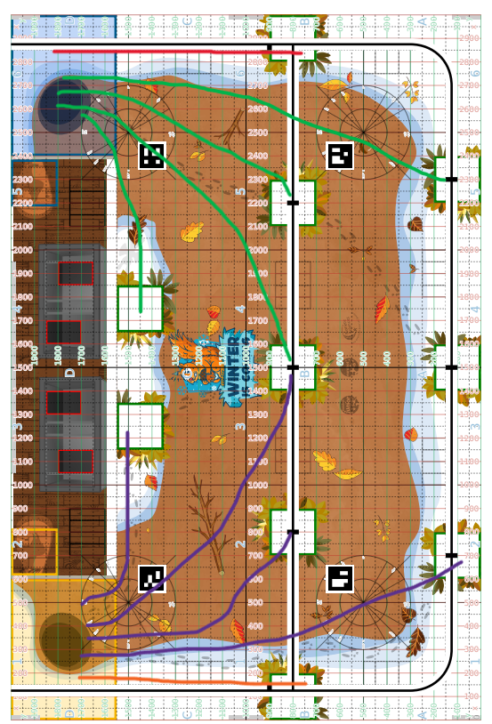

# Solución para las SIMAs pequeñas

## Problema que se va a resolver

Las SIMAs deben de llegar a las despensas y activar un actuador.

## Darío

### Solución gráfica

### Explicación de la Idea

Para poder llevar a cabo esta acción he pensado en usar 5 SIMAs cada una de ellas preprogramadas para llegar a máxima potencia a su despensa correspondiente en menos de 5 segundos.

El plan es que vaya primero una SIMA (la de línea de color rojo para el color azul y la de línea de color naranja para el color naranja) que avance hasta su posición y con un siguelíneas detecte hacia que sentido va la línea negra de la coordenada y 800. Tras eso esa SIMA debe de comunicarse via radio con el resto de SIMAs para que les indiquen hacia que lado deben de ir. Debido a que la línea que describen sería la misma solo que va en sentido contrario, solo haría falta cambiar una variable para el sentido. Una vez tengan establecido el sentido las SIMAs avanzarán a sus respectivas posiciones describiendo la línea verde si el color es azul y la línea morada si el color es naranja. Una vez las SIMAs lleguen deberán de mover un actuador para indicar que están comiendo y por ello que realizan la acción.

Si todo mi plan sale como me gustaría ganaríamos un total de 35 puntos.

### Segunda opción

Debido a que no todo siempre puede funcionar como nosotros queremos, otra idea que se me había ocurrido es que para determinar la dirección de las SIMAs se usa un ultrasonidos en la SIMA ninja y dependiendo del lado que esté más cerca al principio de la partida via radio se elige la dirección. El resto seguiría igual, todas las SIMAs irían de manera automática a su correspondiente despensa y ahí moverían su actuador porque considero que es la estrategia más óptima.
