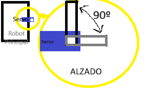
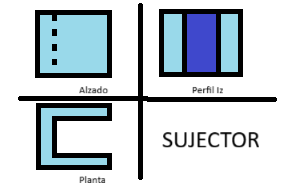
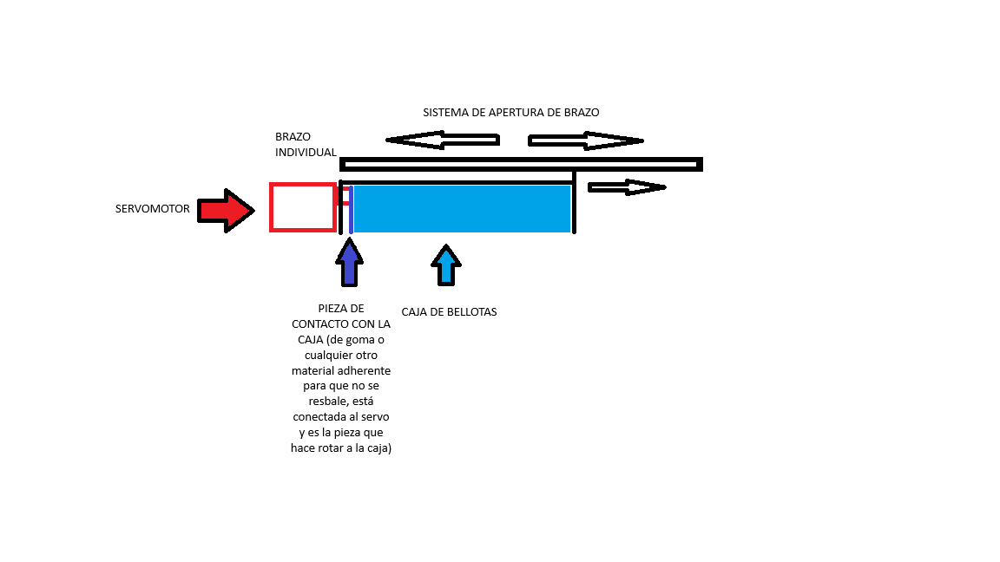
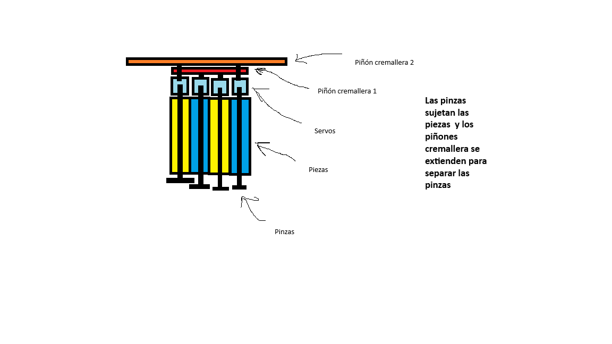

# Robot Principal (Madre) - Chasis Básico

**Instrucciones:**
Describid el diseño del chasis para el Robot Principal. Este robot es único (máximo 1 unidad).

## 1. Descripción del Chasis
*(Dimensiones aproximadas, tipo de tracción, materiales, etc.)*

### Bellotas:

El mecanismo de las bellotas consistiría en toda la zona delantera del robot. En el primer modelo consta de don piñones cremallera uno dentro del otro y una pinza que sujeta cada pieza, y además gira la pieza con un servomotor.

### Termómetro:
    
El mecanismo del termómetro se realizará con una pieza en forma de U tal que la medida entre las dos rectas paralelas se situen a más de lo que mide el propio termometro (100 mm) para poder sujetarlo y desplazarlo lateralmente en ambas direcciones. A su vez esta pieza sera desplegada y retraída mediante un servomotor 9g de 180 para sujetar o no el termometro, se usarán 90 de los 180 grados de libertad del servo, dejando la pieza paralela a la pared cuando esté replegado y perpendicular a la misma cuando se encuentre desplegado. En conclusión, se hará uso de un volumen total al espacio que ocuparía el servomotor puesto que el resto del sistema se puede no tener que modificar el robot principal para que quede totalmente oculto el sistema.
        Piezas necesarias:
        - Servomotor 9g de 180º.
        - Sujector (Pieza posteriormente dibujada).
        - Brazo del servomotor alargado para sujetar el sujector.
            Además, el coche principal necesitará de un movimiento omnidireccional y una placa que permita la conexión de un servomotor (1 pin de señal, 1 pin de corriente positiva de como máximo 5V y un pin de corriente negativa de como máximo 5V), a su vez necesitará un botón en el mando del robot para el despliegue y repliegue del sistema.

## 2. Acciones Asignadas
*(¿Qué tareas realizará este robot? Ej: Recoger avellanas, empujar objetos...)*
- Ajustar temperatura
- Recoger avellanas (el máximo posible)
## 3. Boceto / Esquema
*(Podéis adjuntar una imagen o dibujar con caracteres un esquema básico)*
### Termómetro:
El sistema de sujeccion del termometro (o sujector) ha sido planteado de la siguiente forma:

### Bellotas:
En la recolección y colocación de bellotas las imégenes que representan el primer modelo son:

    - Recoger cajas de avellanas: 
        La forma del chasis es más secundaria, aquí solo voy a describir mi forma de levantar, transportar, rotar, ... etc las cajas de avellanas.
