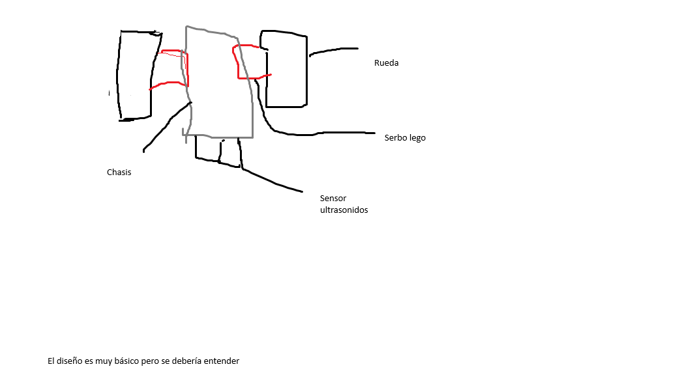

# Simas Obreras - Chasis Básico

**Instrucciones:**
Describid el diseño del chasis para las Simas Obreras. Estas salen a partir del segundo 85 para ir a las despensas. Máximo 6 unidades.

## 1. Descripción del Chasis
Su diseño será similar a las SIMAs del año pasado pero se le van a quitar los sensores infrarrojos porque no van a ser necesarios.
Cada SIMA debe de tener un diseño único para que se puedan distinguir porque cada una tendrá un programa diferente.

## 2. Acciones Asignadas
Cada una de las SIMAs va a ir directamente tras los 85 segundos hacia su despensa correspondiente. Puedes ver la idea más detallada en este [Readme](https://github.com/Ploirad/Arctic_circuits/tree/main/Estrategia/Simas%20pequeñas)

## 3. Cantidad a Fabricar
En un principio se va n a fabricar 3 SIMAs, cada una con diferente diseño y programa. En caso de suficiente tiempo nos dedicaremos a hacer hasta un máximo de dos SIMAs extra dando un total de 5 SIMAs.

## 4. Boceto / Esquema

